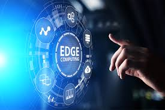

<!-- Profile Banner -->

  

## 👨‍🎓 About Me

- 🎓 **B.Tech in Electronics & Telecommunications @ VIT Pune (2022–2026)**
- 🤖 Machine Learning Intern @ Learn and Empower Pvt. Ltd
- 📚 Curious about Federated Learning, Generative Models, and Data Systems
- 🧑‍🏫 Active contributor to college tech communities and workshops
- 🏆 Best Paper Award — CVR 2025 (Emerging Technologies Category)

---

## 💹 FinTech Enthusiast

- 🏦 Passionate about the intersection of **Finance + Technology**
- 💸 Building intelligent systems for **investment analysis**, **portfolio optimization**, and **market data insight**
- 🚀 Actively seeking **FinTech internships** that blend **AI/ML with financial applications**
- 📊 Hands-on experience with APIs, Spring Boot backends, and real-time financial data systems

---

## 🛠️ Skills & Technologies

---

## 🚀 Featured Projects

### 🏥 Automated Clinical Documentation Platform
> Comprehensive NLP pipeline for automating clinical trial documentation using large language models.
- 🤖 Specialized prompt optimization achieving 89% reduction in manual oversight
- 📋 Robust assessment framework ensuring regulatory compliance
- 🔄 RESTful API integration with containerized deployment
- 🛠️ `Python, LangChain, Hugging Face Transformers, Docker`

---

### 📞 Intelligent Telecom Support System
> Multi-layer intelligent support platform integrating RAG with conversational AI for telecom diagnostics.
- 🧠 Domain-specific model fine-tuning with 43% diagnostic precision enhancement
- 📈 Adaptive user proficiency system reducing escalation incidents by 37%
- 🔍 Vector database integration for enhanced retrieval-augmented generation
- 🛠️ `Python, PyTorch, Vector Databases, AWS Lambda`

---

### 🧠 MedSynGAN: Federated GAN System for Synthetic Medical Images
> A secure, privacy-aware GAN system to generate synthetic chest X-rays using federated learning.
- 🚀 Used DCGAN & ProGAN for training
- 💡 Memory-efficient, privacy-preserving model
- 🏅 **Best Paper Award @ CVR 2025**
- 🛠️ `Python, TensorFlow, Flower Framework`

  

---

### 💰 Knapsack-Based Investment Portfolio Optimization
> Real-time financial decision-making using dynamic programming & RESTful APIs.
- 💻 Backend built using Spring Boot + Alpha Vantage API
- 🔗 REST APIs & React dashboard
- 📈 Maximizes return vs risk trade-off
- 🛠️ `Java, Spring Boot, React`

  

---

### 📍 GeoEdge: Real-time GPS Tracker via Edge Computing
> Offline vehicle tracking system to reduce latency via edge nodes.
- 📡 Real-time optimized GPS analytics
- 🔧 Embedded C & Java
- 🛠️ `Edge Devices, Java, C`

  

---

### 🔬 Distributed Medical Image Synthesis Framework
> Secure federated learning architecture for generating synthetic medical imagery while preserving data privacy.
- 🔒 Enhanced distributed training infrastructure with 40% performance gains
- 🏥 Cross-dataset coordination for medical image generation
- 🐳 Containerized deployment for scalable distributed training
- 🛠️ `Python, TensorFlow, Flower Framework, Docker, Git`

---

## 📑 Publications & Patents

### 📚 Publications

📘 **MedSynGAN: A Federated GAN System for Generating Synthetic Medical Images**  
*International Conference on Computer Vision and Robotics (CVR) 2025*  
*Presented at NIT GOA | Best Paper Award Winner - Emerging Technologies Category*

📊 **AI and ML models in Cross-Asset Class Investment Risk Analysis: A Case Study of Real Estate and Equities Markets**  
*International Conference on Self Sustainable Artificial Intelligence Systems*  
*Research explores Mean-Variance Optimization (MVO) and advanced AI/ML models for efficient investment portfolios*

🔒 **Intelligent and Secure Cloud CRM: Overcoming Compliance and Automation Challenges in Regulated Industries**  
*International Conference on Circuits, Systems and Simulation 2025*  
*Focus on compliance automation and security challenges in cloud-based CRM systems*

### 🛡️ Patents

⚡ **AN IOT-ENABLED ENERGY METER FOR REAL-TIME ELECTRICITY MONITORING AND MANAGEMENT**  
*Patent Application No. 20252100482 A | Filed: 17/01/2025 | Published: 14/02/2025*  
*Vishwakarma Institute of Technology, Pune*  
*IoT-enabled smart energy meter with PZEM-004T module and NodeMCU for real-time electricity monitoring, predictive analytics, and sustainable energy management*

---

## 📚 Certifications

### 📊 Google Data Analytics Professional Certificate — Coursera (2025)
> Covered:
- ✅ Data Visualization, SQL, R, Excel
- ✅ Python-based data pipelines
- ✅ Applied analytics decision-making

  

---

## 📈 GitHub Stats

  
  

---

## 🏆 Experience

### 🧪 ML Intern – Learn and Empower Pvt. Ltd (Aug–Nov 2024)
- Built Indian Sign Language detection system using CV + NLP
- Real-time gesture translation into sentences
- 🔧 Python, OpenCV, TensorFlow

---

## 🌐 Let's Connect

  
  
  

